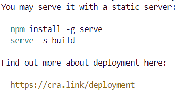

## 자료실
- demo: https://tan-ripe-cattle.app.genez.io/admin/tables
- 소스코드: https://github.com/creativetimofficial/argon-dashboard-react

## 다운로드 필요한 라이브러리
```
npm install react-cookie
```

## 사용방법
1. 해당 디렉토리 클론
   ```
   > git clone https://github.com/SeSAC-Geumcheon-Team3/Team3-FE.git
   ```

2. npm install
   ```
   > npm install
   ```

3. (개발환경일 경우) 실행
   ```
   > npm start
   ```

4. (배포환경일 경우) 프로젝트 빌드
   ```
   > npm run build
   ```

5. (배포환경일 경우) 빌드 실행
   ```
   > npx serve build
   ```
   기타 명령어: 